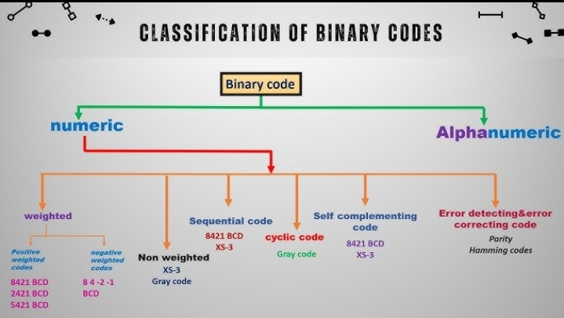

## Binary Systems

---

### Definition

Binary systems represent information using only two symbols: **0** and **1**, forming the foundation of all digital systems.

---

### Advantages of Binary Systems

**Simplicity in Hardware:** Uses only two states that directly map to OFF and ON electrical signals.  
**e.g.** A switch represents 0 (OFF) and 1 (ON).  

**Reliability / Noise Immunity:** Clear separation between two states makes systems resistant to voltage noise.  
**e.g.** 4.9V is reliably interpreted as 1, while 0.1V is interpreted as 0.  

**Ease of Logical Operations:** Binary aligns naturally with Boolean logic used in digital circuits.  
**e.g.** AND, OR, and NOT gates operate directly on binary values.  

**Compact Data Representation:** Large amounts of information can be stored efficiently using bits.  
**e.g.** An 8-bit byte represents 256 values (0–255).  

**Universality in Computing:** Binary can encode numbers, text, and instructions.  
**e.g.** ASCII uses binary patterns to represent characters.

---

### Disadvantages of Binary Systems

Binary systems are ideal for machines but introduce limitations when used by humans.  

**Hard for Humans:** Binary numbers are long and difficult to read.  
**e.g.** 255₁₀ → 11111111₂  

**High Bit Count:** Large numbers require many bits for representation.  
**e.g.** 1023₁₀ → 1111111111₂  

**Resource Overhead:** Binary may consume more memory or bandwidth than decimal-based formats.  

**Manual Arithmetic:** Calculations are harder to perform accurately.  
**e.g.** 101101 + 11011 requires careful bit-by-bit addition.

### Binary Number Code Categories

Binary representation extends beyond pure numbers into structured codes used for storage, communication, and control.

| Category | Examples | Purpose |
|:--------|:----------|:---------|
| **Pure Binary Codes** | Natural Binary | Standard base-2 representation |
| **Weighted Codes** | BCD (8421), Excess-3 | Decimal digit encoding |
| **Non-Weighted Codes** | Gray, Johnson | Error reduction, counters |
| **Alphanumeric Codes** | ASCII, Unicode | Text and symbols |
| **Error-Detecting Codes** | Parity, VRC | Error detection |
| **Error-Correcting Codes** | Hamming, CRC | Error detection and correction |
| **Signed Representations** | 2’s Complement | Positive and negative numbers |
| **Special Logic Codes** | Gray, Biquinary | Counters and encoders |..

  
   
  <em>Figure 1: Classification of Binary Number Codes</em>

---
### Binary Codes by Function

| **Function** | **Examples** | **Use** |
|:--------------|:-------------|:---------|
| **Numeric** | Natural Binary, BCD, 2’s Complement | Arithmetic & storage |
| **Error Control** | Parity, Hamming, CRC | Detect & correct errors |
| **Text / Data** | ASCII, Unicode | Letters & symbols |
| **Logic / Counters** | Gray, Johnson, Ring Counter | Digital circuits & counters |

---

### Self-Complementing Codes
A self-complementing code is a code in which the 9’s complement (or n’s complement for a given range) of a number can be obtained simply by inverting all bits, without extra arithmetic steps are needed.

**Benefit:** Makes subtraction easier—just add the complement.

**Example:** In Excess-3, decimal 2 → 0101; inverting bits → 1010, which is the 9’s complement (decimal 7).

**Note:** Self-Complementing codes are usually BCD. Common in Excess-3 and 2421 (Aiken) codes.

---

### One’s Complement

#### Definition  
One’s complement is a *signed binary number representation* where negative numbers are represented by *inverting all bits* of the corresponding positive number.  

---

#### Uses
- Representing signed integers in digital systems.
- Performing subtraction using addition (via complement addition).
- Simplifying hardware design for arithmetic units in older computers.

---

#### Characteristics
- Uses most significant bit (MSB) as the sign bit (0 for positive, 1 for negative).
- Negative number = invert all bits of positive number.
- Range for n-bit numbers:  
  - Positive: 0 to 2ⁿ⁻¹ - 1  
  - Negative: - (2ⁿ⁻¹ - 1) to -0
- There are two representations for zero: +0 and -0.

---

#### Advantages
- Simple to generate negative numbers by bit inversion.
- Easy subtraction via addition using complements.

---

#### Disadvantages
- Two zeros (+0 and -0) complicate comparisons.
- Arithmetic circuits require end-around carry, adding hardware complexity.
- Less commonly used in modern computers (replaced by two’s complement).

---

### Two’s Complement

---

#### Definition
Two’s complement is a *signed binary number representation* where negative numbers are represented by *inverting all bits* of the corresponding positive number and adding 1.  

---

#### Uses
Two’s complement is the most widely used signed binary representation in modern computers.  
- Representing signed integers in virtually all digital computers.
- Simplifying addition and subtraction circuits.
- Enabling efficient hardware design for arithmetic operations.

---

#### Characteristics  
- MSB acts as the sign bit (0 = positive, 1 = negative).
- Negative number = invert all bits + 1.
- Range for n-bit numbers:  
  - Positive: 0 to 2ⁿ⁻¹ - 1  
  - Negative: -2ⁿ⁻¹ to -1
- Only one zero representation (0).

---

#### Advantages
- Single zero simplifies comparisons.
- Addition and subtraction are uniform; no special end-around carry needed.
- Hardware implementation is simpler and faster than One’s Complement.

---

#### Disadvantages
- Slightly more complex to manually calculate negative numbers.
- Understanding the range and overflow requires care, especially with fixed-width registers.

---

## Binary-Coded Decimal (BCD) Codes

---

### Definition
Binary-Coded Decimal (BCD) is a code that represents decimal digits (0–9) using 4-bit binary codes. Each decimal digit is encoded separately.  

| Variant | Mapping(0–9) | Notes |
|:------------|:-------------------------:|:-----------|
| 8421 BCD   | 0000–1001               | Standard BCD, straightforward weights |
| 5211 BCD   | 0000–1001               | Self-complementing; easier subtraction |
| 2421 BCD   | 0000–1001               | Self-complementing; Aiken code |
| Excess-3   | 0011–1100               | Self-complementing; each digit +3; simplifies subtraction |

  _Table 1: BCD Variants_  

**Note:** Since a 4-bit code can represent up to 1111 (15 in decimal), each BCD variant uses only 10 of the 16 possible combinations (for digits 0–9). This leaves six unused or illegal codes in each BCD system.

---

### Uses
BCD is widely used in digital clocks, calculators, and display systems.  
- Representing decimal numbers in digital circuits.  
- Displaying numbers on seven-segment displays.  
- Performing decimal arithmetic in computers and calculators.

---

### Characteristics  
- 4 bits per decimal digit.  
- Multiple variants exist based on positional weighting  
- Arithmetic requires adjustment logic after binary addition for digits >9.

---

### Advantages
- Easy to display decimal numbers directly.  
- Certain variants are self-complementing, simplifying subtraction.  
- Well-suited for decimal-centric applications.

---

### Disadvantages
- Requires more bits than pure binary for the same number.  
- Arithmetic is less efficient; extra logic needed for carry and correction.  
- Not ideal for large-scale numeric computation compared to straight binary.

---

### Excess-3 (XS-3) Code

#### Definition
Excess-3, also called XS-3, is a self-complementing binary-coded decimal (BCD) code where each decimal digit is represented by its 4-bit binary equivalent plus 3.  

---

#### Uses
It is commonly used in digital systems and calculators.
- Representing decimal digits in digital circuits.
- Simplifying subtraction using complements (self-complementing property).
- Employed in digital clocks, calculators, and early computers.

---

#### Characteristics  
- 4-bit code for each decimal digit (0–9).  
- Self-complementing: 9’s complement of a number = invert all bits.  
- Useful for BCD arithmetic.  

| *Decimal* | *Binary* | *XS-3* |
|:---------:|:--------:|:----------------|
| 0         | 0000     | 0011             |
| 1         | 0001     | 0100             |
| 2         | 0010     | 0101             |
| 14        | 1110     | 0100 0111        |  

  _Table 2: Excess-3(XS-3) Code Table(selected values)_

**Note:** For multi-digit numbers, encode each decimal digit separately in 4-bit Excess-3, forexample, 14 is represented as two 4-bit groups: 0100 (1) and 0111 (4).

---

#### Advantages
- Self-complementing, making subtraction simpler.  
- Avoids negative zero problem found in One’s Complement.  
- Easy to implement in decimal arithmetic circuits.

---

#### Disadvantages
- Not a natural binary; requires conversion from decimal to XS-3.  
- Slightly more complex hardware than pure BCD or straight binary.  
- Only practical for decimal digit representation, not general binary arithmetic.

---

<!--
← [Previous: Number Systems Overview](00-Number-Systems.md) | [Next: Binary Number Codes](02-Binary-Codes.md) →
-->